# Filament DateRange

[](https://packagist.org/packages/codewithkyrian/filament-date-range)
[](https://packagist.org/packages/codewithkyrian/filament-date-range)
[](https://packagist.org/packages/codewithkyrian/filament-date-range)

**Filament DateRange** is a sleek and lightweight plugin, built purely ontop AlpineJs that provides a date range picker and filter for the [Filament](https://filamentphp.com/) panel.

It has a remarkably small footprint (JS ~105KB, gzipped ~26.2KB), ensuring your admin panel remains fast and responsive without sacrificing functionality or a polished look and feel.

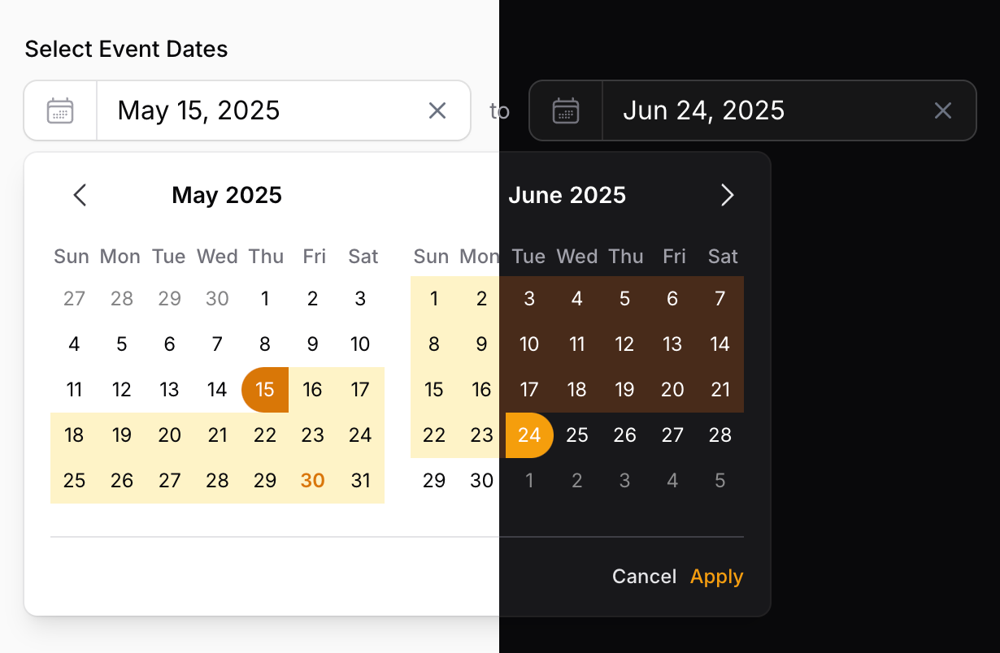

## Features

*   **Intuitive Date Range Picker Form Field:** Allows users to easily select "start" and "end" dates.
*   **Powerful Table Filter:** Seamlessly filter your table records by date ranges.
*   **Lightweight & Performant:** Pure AlpineJS implementation with a minimal asset footprint.
*   **Highly Customizable:** Extensive API for tailoring appearance, behavior, date formats, locales, and more.
*   **RTL Support:** Automatically adjusts for right-to-left languages.
*   **Localization Ready:** Comes with translations for many common locales.
*   **Seamless Filament Integration:** Designed to look and feel native to the Filament ecosystem.

## Installation

You can install the package via Composer:

```bash
composer require codewithkyrian/filament-date-range
```

If you wish to customize the translations, you can publish them using:

```bash
php artisan vendor:publish --tag="filament-date-range-translations"
```

Similarly, you can also publish the views if you wish using:

```bash
php artisan vendor:publish --tag="filament-date-range-views"
```

## Form Field: `DateRangePicker`

The `DateRangePicker` component provides an elegant way to select a date range within your Filament forms.

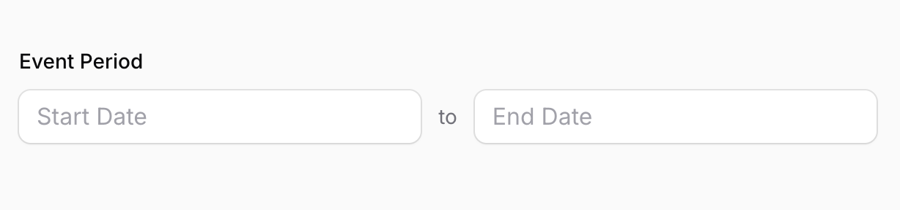

### Basic Usage

To use the field, simply add it to your form schema:

```php
use CodeWithKyrian\FilamentDateRange\Forms\Components\DateRangePicker;

DateRangePicker::make('event_period')
                ->label('Event Period'),
```

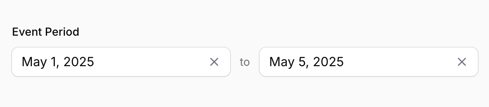

The field internally manages its state as an array with `start` and `end` keys, for example: `['start' => '2024-01-15', 'end' => '2024-01-20']`. How this state is persisted depends on your model and database structure.

#### Storing as a Single JSON Attribute

If you intend to store the date range in a single database column (e.g., a `json` column named `event_period`), ensure your Eloquent model casts this attribute to an `array` or `json`:

```php
protected $casts = [
    'event_period' => 'json',
];
```

#### Storing in Separate Date Columns

If you prefer to store the start and end dates in separate database columns (e.g., `starts_at` and `ends_at`), the recommended approach is to define an Eloquent Accessor & Mutator on your model for a virtual attribute.

```php
use Illuminate\Database\Eloquent\Casts\Attribute;
use Illuminate\Support\Carbon;

protected function eventPeriod(): Attribute
{
    return Attribute::make(
        get: fn ($value, array $attributes) => [
            'start' => $attributes['starts_at'] ?? null,
            'end'   => $attributes['ends_at'] ?? null,
        ],
        set: fn (?array $value) => [
            'starts_at' => $value['start'] ? Carbon::parse($value['start']) : null,
            'ends_at'   => $value['end'] ? Carbon::parse($value['end']) : null,
        ],
    );
}

// To ensure the `event_period` virtual attribute is correctly handled during mass assignment operations (e.g., `Model::create([])` or `Model::update([])`),
// add its name to the `$fillable` array. This allows the `set` accessor to process the incoming date range.
protected $fillable = [
    // other fillables
    'event_period'
];


// To ensure your `event_period` attribute is available when Filament populates
// the form for an existing record, you may need to add it to the `$appends` array on your model:
protected $appends = [
    'event_period',
];
```

```php
use CodeWithKyrian\FilamentDateRange\Forms\Components\DateRangePicker;

DateRangePicker::make('event_period')
    ->label('Event Period')
```

### Customization Options

#### `displayFormat(string | Closure | null $format)`

Sets the display format for dates in the input fields. Accepts a **PHP date format** string. Defaults to `M j, Y` (e.g., "Jan 15, 2024"). See [PHP date formats](https://www.php.net/manual/en/function.date.php).
```php
DateRangePicker::make('booking_dates')
    ->displayFormat('d/m/Y') // Displays as "15/01/2024"
```
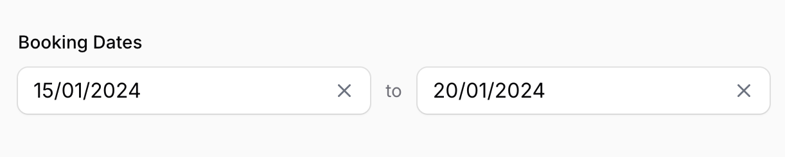

#### `format(string | Closure $format)`

Sets the underlying storage format for dates (used for component state and database interaction). Accepts a **PHP date format** string. Defaults to `Y-m-d` (e.g., "2024-01-15"). See [PHP date formats](https://www.php.net/manual/en/function.date.php).
```php
DateRangePicker::make('log_period')
    ->format('Y-m-d H:i:s') // Stores as "2024-01-15 10:30:00"
```

#### `minDate(CarbonInterface | string | Closure | null $date)`

Sets the earliest selectable date. Dates before this will be disabled in the calendar.
```php
DateRangePicker::make('future_event')
    ->minDate(now()->addDay())
```
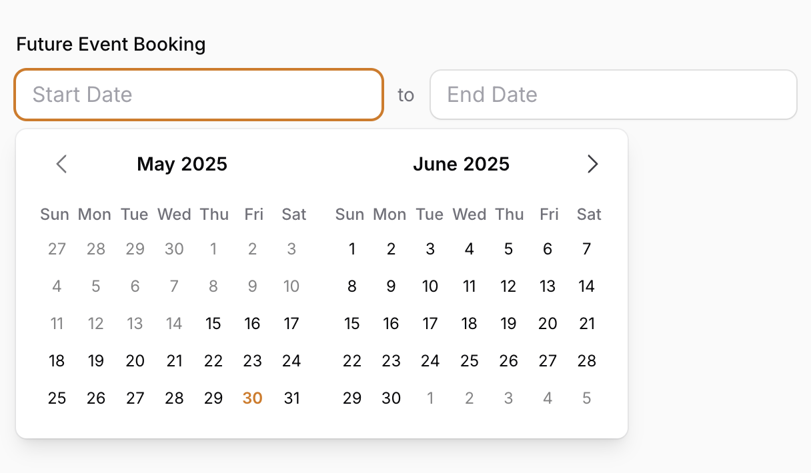

#### `maxDate(CarbonInterface | string | Closure | null $date)`

Sets the latest selectable date. Dates after this will be disabled.
```php
DateRangePicker::make('past_event')
    ->maxDate(now()->subDay())
```


#### `enabledDates(array | Closure | null $dates)`

Sets specific enabled dates. When provided, only the dates in this array will be selectable; all other dates will be disabled. Accepts an array of dates (as Carbon instances or strings) or a closure that returns such an array.
```php
DateRangePicker::make('available_dates')
    ->enabledDates([
        '2024-01-15',
        '2024-01-16', 
        '2024-01-20',
        now()->addDays(5),
    ])
```

#### `locale(string | Closure | null $locale)`

Sets the locale for the calendar (month names, day names) and potentially for parsing/displaying dates if the format string is locale-aware. Defaults to your application's current locale.
```php
DateRangePicker::make('période')
    ->locale('fr')
```
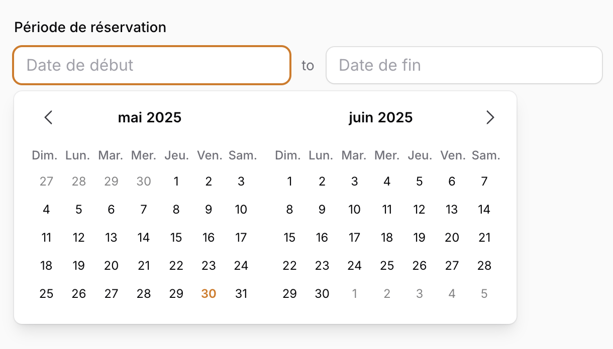

#### `timezone(string | Closure | null $timezone)`

Specifies the timezone to be used for interpreting and processing dates. Defaults to your application's timezone (`config('app.timezone')`).
```php
DateRangePicker::make('appointment_time')
    ->timezone('America/New_York')
```

#### `firstDayOfWeek(int | Closure $day)`

Sets the first day of the week in the calendar view. `0` for Sunday (default), `1` for Monday, ..., `6` for Saturday.
```php
DateRangePicker::make('work_schedule')
    ->firstDayOfWeek(1) // Week starts on Monday
```
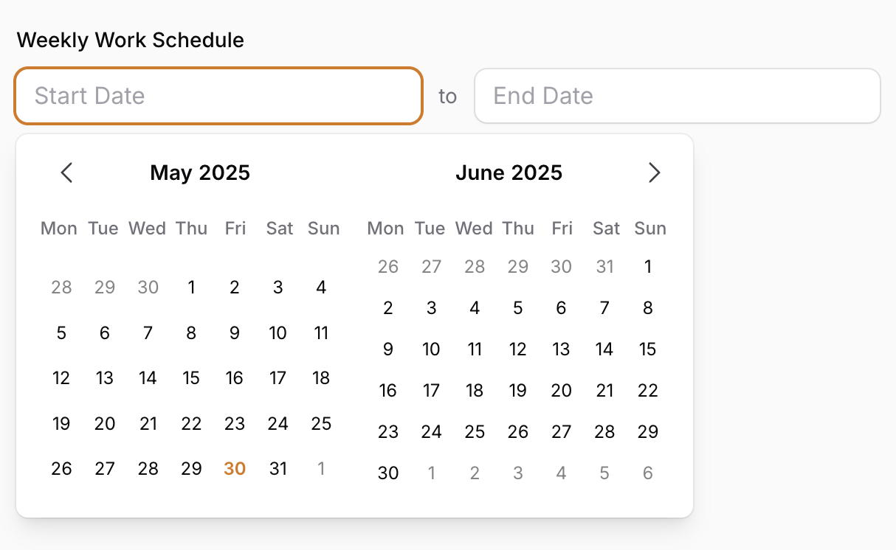

#### `startPlaceholder(string | Closure | null $placeholder)`

Sets the placeholder text for the "Start" date input field. Defaults to a localized "Start Date".
```php
DateRangePicker::make('travel_itenery')
    ->startPlaceholder('Departure Date')
```

#### `endPlaceholder(string | Closure | null $placeholder)`

Sets the placeholder text for the "End" date input field. Defaults to a localized "End Date".
```php
DateRangePicker::make('travel_itenery')
    ->endPlaceholder('Return Date')
```


#### `separator(string | Htmlable | Closure $separator)`

Customizes the text or HTML displayed between the "Start" and "End" input fields. Defaults to "to".
```php
DateRangePicker::make('duration')
    ->separator('through')
```

#### `separatorIcon(string | Closure | null $icon)`

A convenience method to use a Filament icon as the separator.
```php
DateRangePicker::make('project_duration')
    ->separatorIcon('heroicon-o-arrow-long-right')
```
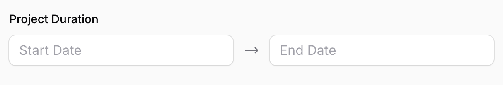

#### `autoClose(bool | Closure $condition = true)`

If `true` (default), the calendar popover will close immediately after a valid date range (both start and end dates) is selected. If `false`, "Apply" and "Cancel" buttons are shown in the popover, requiring an explicit click to confirm the selection and close.
```php
DateRangePicker::make('conference_dates')
    ->autoClose(true)
```
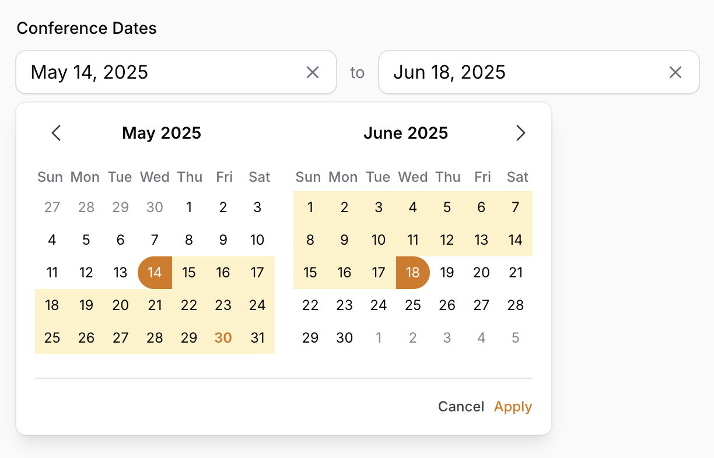

#### `dualCalendar(bool | Closure $condition = true)`

Determines if two calendars (for consecutive months) should be displayed side-by-side in the popover. Defaults to `true` (dual calendars). Set to `false` to display a single calendar.
```php
DateRangePicker::make('date_range')
    ->dualCalendar(false) // Show only a single month calendar
```
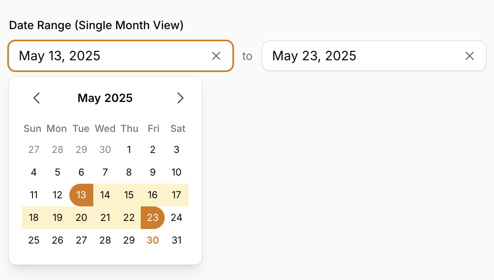

#### `inline(bool | Closure $condition = true)`

Controls whether the start and end inputs are displayed inline (horizontally) or stacked (vertically). Defaults to `true` (inline layout).
```php
DateRangePicker::make('event_period')
    ->inline() // Display inputs side by side (default)
```
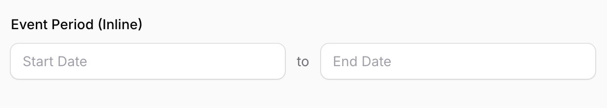

#### `stacked(bool | Closure $condition = true)`

A convenience method to set the layout to stacked (vertical). Equivalent to `->inline(false)`.
```php
DateRangePicker::make('event_period')
    ->stacked() // Display inputs vertically stacked
```
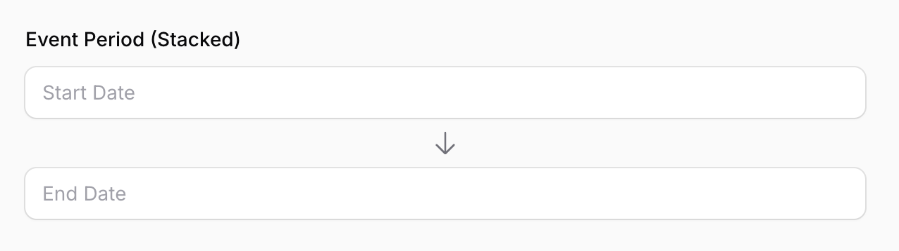

#### `readOnly(bool | Closure $condition = true)`

Makes the input fields read-only, preventing direct text input (selection via calendar is still possible).

#### `disabled(bool | Closure $condition = true)`

Disables the entire component, preventing any interaction.

#### Affixes (Prefixes & Suffixes)

You can add icons, labels, or actions as prefixes or suffixes to both the "Start" and "End" input fields individually, similar to how the inbuilt Filament fields work.

Available methods (replace `start` with `end` for the "End" input):
-   `startPrefix(string | Htmlable | Closure | null $label, bool | Closure $isInline = false)`
-   `startPrefixIconColor(string | array | Closure | null $color = null)`
-   `startPrefixIcon(string | Closure | null $icon, bool | Closure $isInline = false)`
-   `startPrefixAction(Action | Closure $action, bool | Closure $isInline = false)`
-   `startPrefixActions(array $actions, bool | Closure $isInline = false)`
-   `startSuffix(string | Htmlable | Closure | null $label, bool | Closure $isInline = true)`
-   `startSuffixIcon(string | Closure | null $icon, bool | Closure $isInline = true)`
-   `startSuffixIconColor(string | array | Closure | null $color = null)`
-   `startSuffixAction(Action | Closure $action, bool | Closure $isInline = true)`
-   `startSuffixActions(array $actions, bool | Closure $isInline = true)`
-   `inlineStartPrefix(bool | Closure $isInline = true)`
-   `inlineStartSuffix(bool | Closure $isInline = true)`

Example:
```php
use Filament\Forms\Components\Actions\Action;

DateRangePicker::make('licence_validity')
    ->startPrefix('Valid')
    ->endSuffixAction(
        Action::make('info')
            ->icon('heroicon-o-information-circle')
            ->tooltip('This range is inclusive.')
            ->action(fn () => null)
    )
```

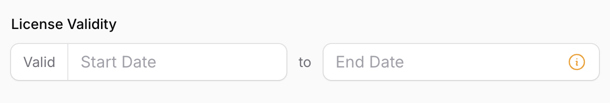


## Table Filter: `DateRangeFilter`

The `DateRangeFilter` allows you to easily filter records in your Filament tables based on a date column falling within a selected range.

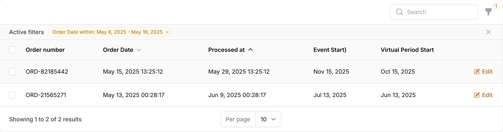

### Basic Usage

Add the `DateRangeFilter` to your table's filters array:

```php
use CodeWithKyrian\FilamentDateRange\Tables\Filters\DateRangeFilter;

DateRangeFilter::make('created_at'
            ->label('Created within'),
```

When activated, this filter will display the `DateRangePicker` component, allowing users to select a "start" and "end" date.

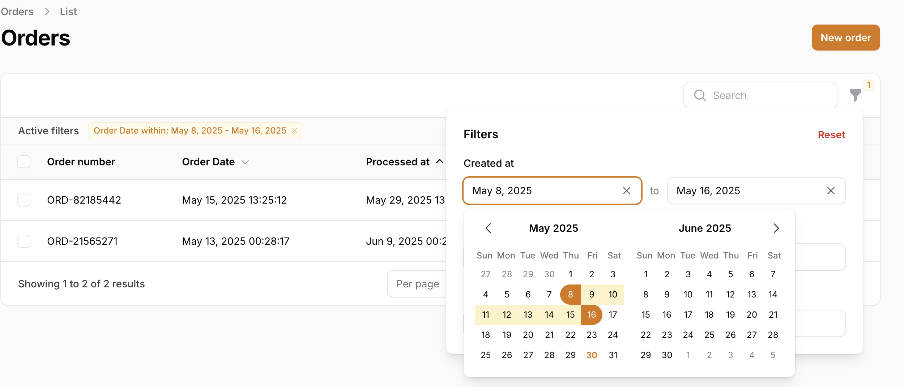

### Filter Configuration

The `DateRangeFilter` mirrors many of the customization methods available on the `DateRangePicker` form component, passing them through to the underlying picker:

-   `displayFormat(string | Closure | null $format)`
-   `format(string | Closure | null $format)` (Note: The filter state uses `Y-m-d` by default for its internal `start` and `end` values)
-   `minDate(CarbonInterface | string | Closure | null $date)`
-   `maxDate(CarbonInterface | string | Closure | null $date)`
-   `enabledDates(array | Closure | null $dates)`: Sets specific enabled dates; all other dates will be disabled
-   `timezone(string | Closure | null $timezone)`
-   `locale(string | Closure | null $locale)`
-   `firstDayOfWeek(int | Closure $day)`
-   `startPlaceholder(string | Closure | null $placeholder)`
-   `endPlaceholder(string | Closure | null $placeholder)`
-   `autoClose(bool | Closure $condition = true)`: For filters, defaulting to `true` often provides a smoother UX, as the filter applies once the range is set and the popover closes.
-   `dualCalendar(bool | Closure $condition = true)`
-   `inline(bool | Closure $condition = true)`: Controls whether the start and end inputs are displayed horizontally (default) or vertically
-   `stacked(bool | Closure $condition = true)`: Convenience method to set vertical layout, equivalent to `->inline(false)`

Example:
```php
DateRangeFilter::make('processed_at')
    ->label('Processing Date')
    ->displayFormat('d M Y')
    ->minDate(now()->subYear())
```

### Query Application

The filter, by default, applies a `WHERE column >= start_date AND column <= end_date` condition to your Eloquent query. The `start_date` is taken as the start of the selected day, and `end_date` as the end of the selected day, respecting the configured timezone.

#### `modifyQueryUsing(Closure $callback)`

For more complex filtering logic, you can provide a custom query modification callback.
```php
DateRangeFilter::make('event_span')
    ->label('Event Overlaps With')
    ->modifyQueryUsing(function (Builder $query, array $data, $state) {
        $start = $state['start'] ? Carbon::parse($state['start'])->startOfDay() : null;
        $end = $state['end'] ? Carbon::parse($state['end'])->endOfDay() : null;

        if ($start && $end) {
            return $query->where(function (Builder $query) use ($start, $end) {
                $query->where('event_starts_at', '<=', $start)
                        ->where('event_ends_at', '>=', $end);
            });
        }
        return $query;
    })
```

### Filter Indicator

The filter automatically provides an indicator when active, displaying the selected range. Example: "Created within: Jan 15, 2024 - Jan 20, 2024".
The date format used in the indicator matches the `displayFormat` of the picker.

## Localization

This package is translation-ready. It includes translations for placeholders and button labels within the picker. The following locales are currently supported:

ar, bs, ca, ckb, cs, cy, da, de, en, es, et, fa, fi, fr, hi, hu, hy, id, it, ja, ka, km, ko, ku, lt, lv, ms, my, nl, no, pl, pt_BR, pt_PT, ro, ru, sk, sl, sv, th, tr, uk, uz, vi, zh_CN, zh_TW.

To publish the translation files to your `lang/vendor/filament-date-range` directory for customization:

```bash
php artisan vendor:publish --tag="filament-date-range-translations"
```

The component will use the application's current locale by default.

## Custom Styling

The component uses a minimal set of custom CSS classes for specific structural elements (like date cell rounding for LTR/RTL) that might not be covered by Filament's default Tailwind build. These styles are automatically registered.

All color-related styling (primary colors, text, backgrounds) is designed to inherit directly from your active Filament theme, ensuring visual consistency.

If you need to deeply customize the HTML structure, you can publish the main view:

```bash
php artisan vendor:publish --tag="filament-date-range-views"
```

This will publish `date-range-picker.blade.php` to `resources/views/vendor/filament-date-range/forms/components/`. **Caution:** Modifying this directly can make updating the package more complex.

## Contributing

Found a bug or have a feature request? Please open an issue. Pull requests are also welcome!

Thank you for using Filament DateRange! I hope it enhances your Filament applications. Consider starring the repository on GitHub if you find it useful!

## License

Filament DateRange is open-sourced software licensed under the [MIT license](LICENSE).